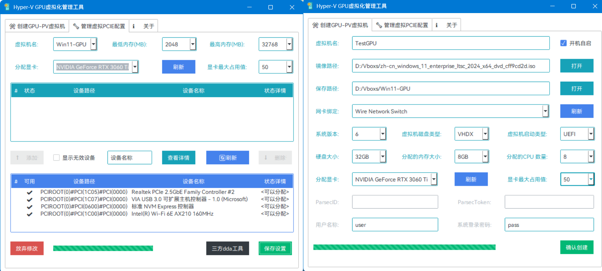

# Hyper-V GPU Virtualization Manage Tool

# Hyper-V GPU虚拟化和DDA管理工具

致力于简化 Windows Hyper-V 上的 GPU 半虚拟化！

### 使用条件 / Prerequisites:

| 类型 / Item          | 主机要求 / Host                                              | 虚拟机要求 / VM                                              |
| -------------------- | ------------------------------------------------------------ | ------------------------------------------------------------ |
| 系统版本 / OSVersion | Windows 10 20H1+ Pro/Enterprise/Education（GPU-PV Only!） Windows 11 22h1+ Pro/Enterprise/Education（GPU-PV Only!） Windows Server 2016~2025 Stand/DataCenter（GPU-PV & DDA）  | 虚拟机系统与主机系统尽量保持一致 Matched Windows versions between the host and VM. (Win10 21H1 + Win10 21H1, or Win11 21H2 + Win11 21H2) |
| 硬件支持 / Hardwares | GPU-PV：Dedicated NVIDIA/AMD GPU（N/AMD独显） GPU-PV：Integrated Intel Graphic（Intel核显） DDA ：All PCIe Devices with PNPM（PCI都支持）  | /                                                            |
| 软件要求 / Softwares | VT-x/VT-d on BIOS is Enable（开启VT-x和VT-d） Hyper-V Function is Enable（开启Hyper-V功能） SecureDeviceAssignment Off（关闭SDA安全分配）  | /                                                            |

### 使用方法 / Instructions

1. 确保您的系统和硬件满足上述要求，下载[最新虚拟化工具](https://github.com/PIKACHUIM/HyperVGPUApp/releases)，解压后打开
2. 下载一个和**你系统对应的系统镜像**，建议[下载微软官方Windows 10](https://www.microsoft.com/zh-cn/software-download/windows10)或[11](https://www.microsoft.com/zh-cn/software-download/windows11)
3. 启用Hyper-V功能，打开软件，设置您的显卡、镜像路径和安装所需参数
4. 创建将自动完成并启动虚拟机，您可直接通过管理工具或远程软件访问！

1. Ensure that your system and hardware meet the above requirements and download the [latest virtualization tools](https://github.com/PIKACHUIM/HyperVGPUApp/releases)
2. Download a system image that corresponds to your system. It is recommended to download [Windows 10](https://www.microsoft.com/zh-cn/software-download/windows10) Or [Windows 11](https://www.microsoft.com/zh-cn/software-download/windows11)
3. Enable the Hyper-V feature, open the software, set your graphics card, image path, and installation parameters
4. The creation will automatically complete and start the virtual machine.
5. You can access directly through management tools or remote software!

### 已知问题 / Known Issues

- AMD Polaris等独立显卡和部分核显对半虚拟化支持不够友好，暂不支持使用GPU-PV，只能使用DDA分配
- Parsec/Moonlight 等串流软件需要虚拟显示器驱动才能亮屏，否则屏幕黑屏。当然，可以使用远程桌面
- 如果不使用本工具创建系统，先手动创建再分配，任务管理器看不到GPU使用情况，因此不推荐这种方法
- AMD Polaris and other independent graphics cards, as well as some core displays, are not friendly enough for semi virtualization support. GPU-PV is not currently supported and can only be allocated using DDA
- Streaming software such as Parsec/Moonlight require a virtual display driver to turn on the screen, otherwise the screen will turn black. Of course, remote desktop can be used
- If you do not use this tool to create a system, manually create a reallocation first. The task manager cannot see the GPU usage, so this method is not recommended

### 注意事项 / Notes:

- 如果使用Parsec，就不要使用Microsft Hyper-V GPU和远程桌面，否则大概率出现黑屏
- Vulkan 渲染器不可用，OpenGL 大部分情况能用，也有的不能用，GPU-Z看不到PV的显卡
- 要使用 Rufus 下载 Windows ISO，它必须启用“检查更新”功能，推荐直接从微软官方下载
- 任务管理器可能看不到GPU信息（已知问题#3），只要在设备管理器中没有报错，就能用
- GPU 将在设备管理器中具有 Microsoft 驱动程序，而不是 nvidia/intel/amd 驱动程序
-  UAC 提示、进入和退出全屏以及在 Parsec 中切换视频编解码器时，可能黑屏长达10秒
- 首次安装会重启若干次，可能会在安装动程序之前进入登录屏幕，然后驱动会在后台安装

- If using Parsec, do not use Microsft Hyper-V GPU and Remote Desktop, otherwise black screens are likely to appear
- Vulkan renderer not available, OpenGL mostly works, but some may not, GPU-Z cannot see PV graphics card
- To download Windows ISO using Rufus, it is necessary to enable the 'Check for Updates' feature, and it is recommended to download it directly from Microsoft's official website
- The task manager may not be able to see GPU information (known issue # 3), as long as there are no errors reported in the device manager, it can be used
- GPU will have Microsoft drivers in Device Manager instead of Nvidia/Intel/AMD drivers
- UAC prompts, entering and exiting full screen, and switching video codecs in Parsec may result in black screen for up to 10 seconds
- The first installation will restart several times and may enter the login screen before installing the software, and then the driver will be installed in the background

## 特别鸣谢 / Thanks

- [jamesstringerparsec/Easy-GPU-PV: A Project dedicated to making GPU Partitioning on Windows easier ](https://github.com/jamesstringerparsec/Easy-GPU-PV)
- [KharchenkoPM/Interactive-Easy-GPU-PV: A Project dedicated to making GPU Partitioning on Windows way easier ](https://github.com/KharchenkoPM/Interactive-Easy-GPU-PV)
- [chanket/DDA: 实现Hyper-V离散设备分配功能的图形界面工具。A GUI Tool For Hyper-V's Discrete Device Assignment(DDA). ](https://github.com/chanket/DDA)

